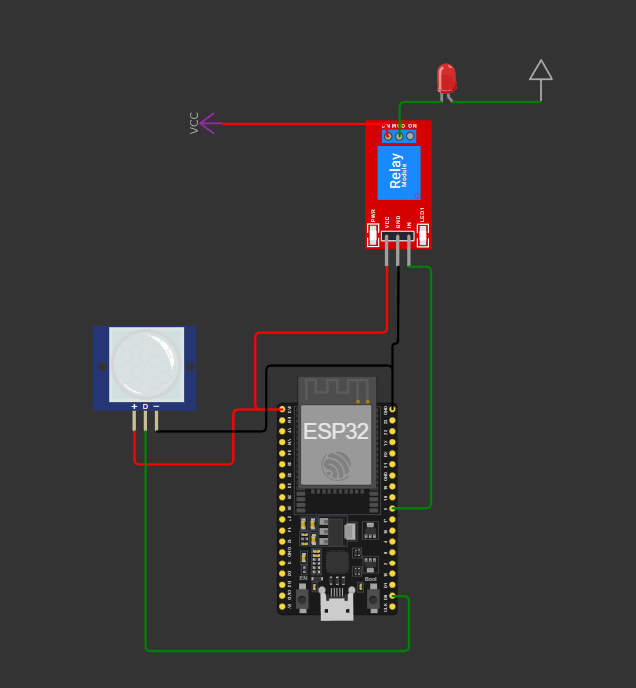
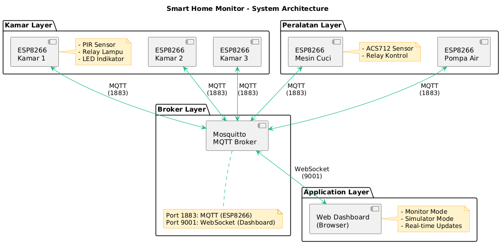
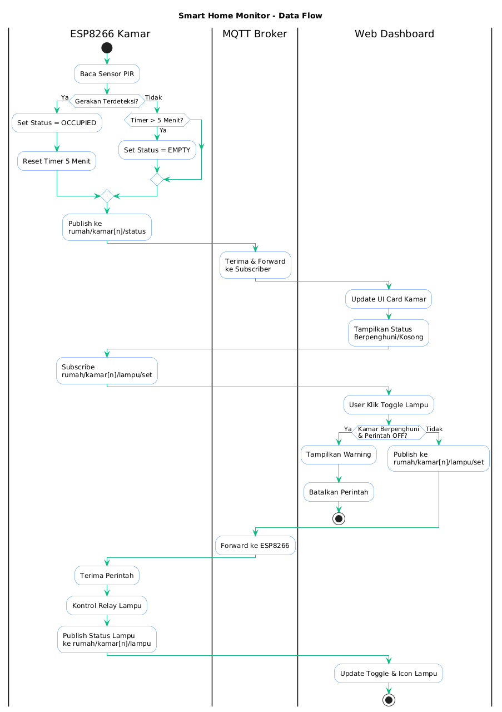
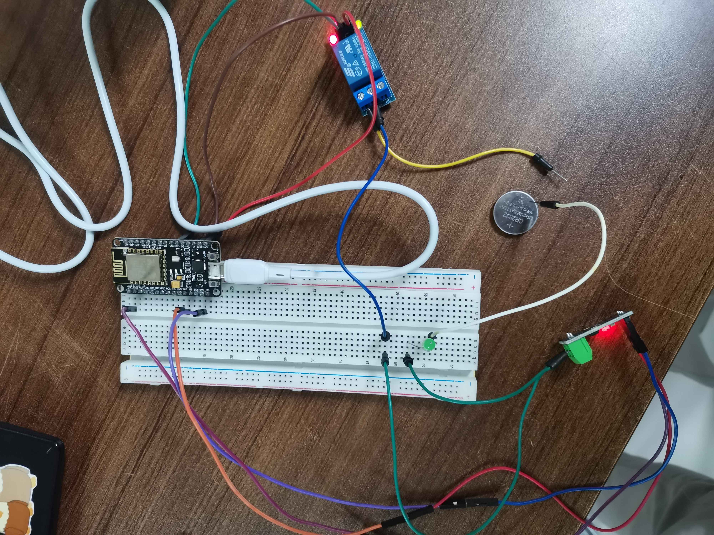
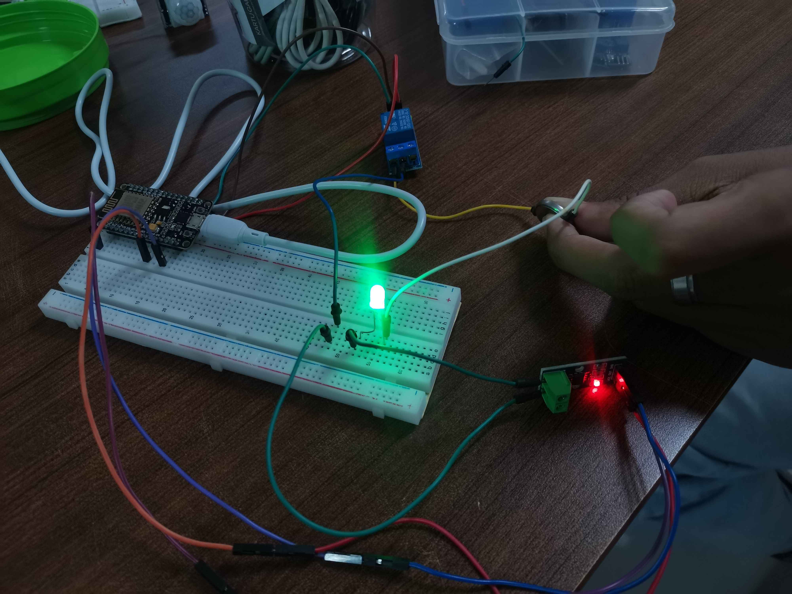
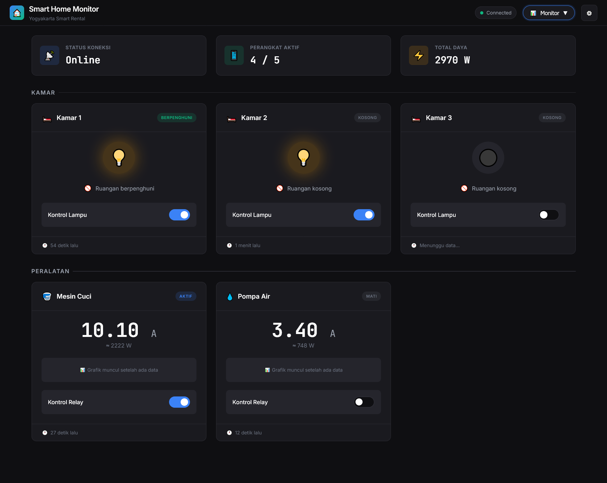
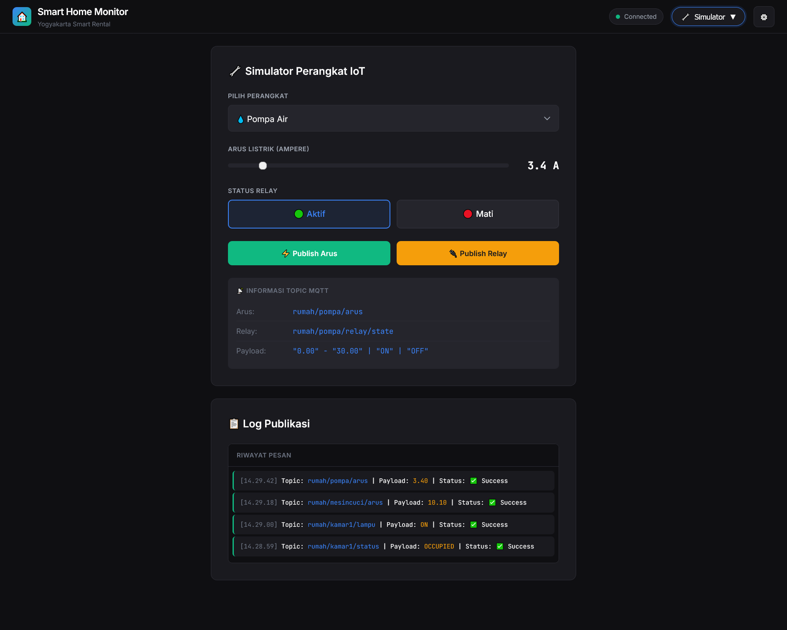
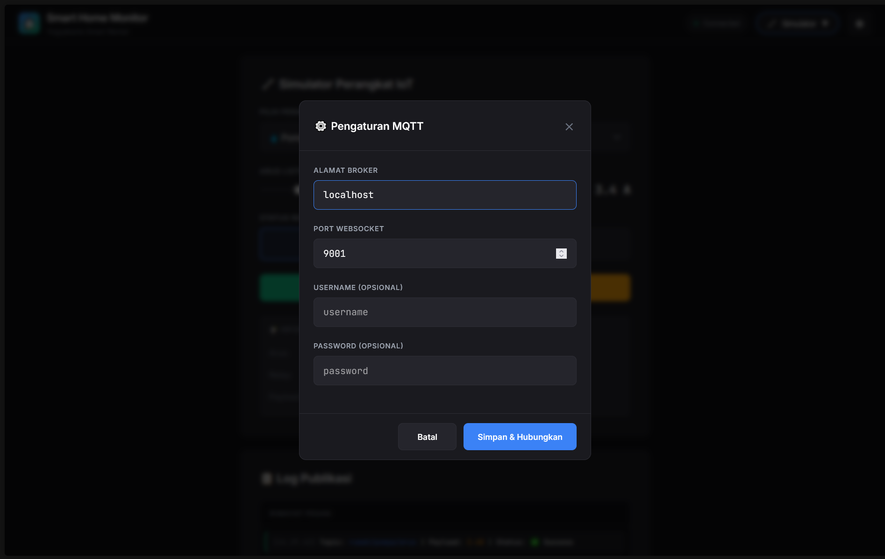

# Smart Home Monitor - Sistem Monitoring Rumah Kos Berbasis IoT

Sistem monitoring dan kontrol rumah kos pintar berbasis IoT yang memantau 3 kamar dan 2 peralatan listrik (mesin cuci & pompa air) secara real-time menggunakan protokol MQTT.

## Daftar Isi

- [Ringkasan Cara Kerja Sistem](#ringkasan-cara-kerja-sistem)
- [Hardware & Software](#hardware--software)
- [Rangkaian (Wiring Diagram)](#rangkaian-wiring-diagram)
- [Arsitektur Aplikasi & Jaringan](#arsitektur-aplikasi--jaringan)
- [Topik & Payload MQTT](#topik--payload-mqtt)
- [Cara Instalasi](#cara-instalasi)
- [Cara Pengoperasian & Pengujian](#cara-pengoperasian--pengujian)
- [Hasil Pengoperasian & Pengujian](#hasil-pengoperasian--pengujian)
- [Foto Perangkat](#foto-perangkat)
- [Tangkapan Layar Dashboard](#tangkapan-layar-dashboard)

---

## Ringkasan Cara Kerja Sistem

**Smart Home Monitor** adalah sistem IoT untuk monitoring dan kontrol rumah kos yang terdiri dari:

### Cara Kerja

1. **Monitoring Kamar (3 Unit)**
   - Sensor PIR mendeteksi keberadaan penghuni di setiap kamar
   - Status hunian ("OCCUPIED" / "EMPTY") dikirim ke broker MQTT
   - Lampu kamar dapat dikontrol secara remote melalui dashboard
   - **Safety Logic**: Lampu tidak dapat dimatikan jika kamar berpenghuni

2. **Monitoring Peralatan Listrik (2 Unit)**
   - Sensor ACS712 mengukur arus listrik pada mesin cuci dan pompa air
   - Data arus dikirim setiap 2 detik ke broker MQTT
   - Relay dapat dikontrol untuk menyalakan/mematikan peralatan secara remote
   - Dashboard menampilkan estimasi daya (Watt) dan grafik trend konsumsi

3. **Dashboard Web Real-time**
   - Menampilkan status semua perangkat secara real-time
   - Mode Monitor untuk pemantauan dan kontrol
   - Mode Simulator untuk pengujian tanpa hardware

### Alur Data

```
[Sensor PIR/ACS712] → [ESP8266] → [MQTT Broker] → [Web Dashboard]
                                       ↑
[Kontrol Lampu/Relay] ← [ESP8266] ← [MQTT Broker] ← [Web Dashboard]
```

---

## Hardware & Software

### Komponen Hardware

| Komponen | Model/Tipe | Jumlah | Fungsi |
|----------|-----------|--------|--------|
| Microcontroller | ESP8266 (NodeMCU) | 5 | Controller utama & konektivitas WiFi |
| Sensor Gerak | PIR HC-SR501 | 3 | Deteksi keberadaan penghuni kamar |
| Sensor Arus | ACS712 (5A/20A/30A) | 2 | Mengukur konsumsi arus listrik |
| Relay Module | 5V 1-Channel | 5 | Kontrol lampu dan peralatan listrik |
| LED Indikator | LED 5mm | 3 | Indikator status per kamar |
| Resistor | 220Ω, 10kΩ | Sesuai kebutuhan | Pull-up dan pembatas arus |
| Breadboard | - | Sesuai kebutuhan | Prototyping |
| Kabel Jumper | Male-Male, Male-Female | Sesuai kebutuhan | Koneksi komponen |
| Power Supply | 5V 2A Adapter | 5 | Sumber daya ESP8266 |

### Software & Tools

| Software | Versi | Fungsi |
|----------|-------|--------|
| Arduino IDE | 1.8.19+ | Programming ESP8266 |
| Mosquitto MQTT Broker | 2.0+ | Message broker |
| Web Browser | Chrome/Firefox/Edge | Akses dashboard |
| Python | 3.x | Local web server (opsional) |
| VS Code + Live Server | Latest | Development & testing |

### Library Arduino yang Dibutuhkan

```cpp
#include <ESP8266WiFi.h>    // Koneksi WiFi
#include <PubSubClient.h>   // MQTT Client
```

---

## Rangkaian (Wiring Diagram)

### Rangkaian Node Kamar (ESP8266 + PIR + Relay)



**Konfigurasi Pin Node Kamar:**

| Komponen | Pin ESP8266 | Keterangan |
|----------|-------------|------------|
| PIR Sensor | GPIO 16 (D0) | Input digital |
| Relay Lampu | GPIO 14 (D5) | Output kontrol lampu |
| LED Indikator | GPIO 2 (D4) | Built-in LED |

### Rangkaian Node Peralatan (ESP8266 + ACS712 + Relay)


**Konfigurasi Pin Node Peralatan:**

| Komponen | Pin ESP8266 | Keterangan |
|----------|-------------|------------|
| ACS712 Output | A0 | Input analog (ADC) |
| Relay | GPIO 13 (D7) | Output kontrol relay |

---

## Arsitektur Aplikasi & Jaringan

### Diagram Arsitektur Sistem



### Diagram Alur Data



---

## Topik & Payload MQTT

### Struktur Topik

| Topik | Tipe | Arah | QoS | Deskripsi |
|-------|------|------|-----|-----------|
| `rumah/kamar[1-3]/status` | Sensor | ESP → Broker | 1 | Status hunian kamar |
| `rumah/kamar[1-3]/lampu` | Status | ESP → Broker | 1 | Status lampu kamar |
| `rumah/kamar[1-3]/lampu/set` | Command | Dashboard → ESP | 1 | Perintah kontrol lampu |
| `rumah/mesincuci/arus` | Sensor | ESP → Broker | 1 | Pembacaan arus mesin cuci |
| `rumah/mesincuci/relay/state` | Status | ESP → Broker | 1 | Status relay mesin cuci |
| `rumah/mesincuci/relay/set` | Command | Dashboard → ESP | 1 | Perintah kontrol relay |
| `rumah/pompa/arus` | Sensor | ESP → Broker | 1 | Pembacaan arus pompa air |
| `rumah/pompa/relay/state` | Status | ESP → Broker | 1 | Status relay pompa air |
| `rumah/pompa/relay/set` | Command | Dashboard → ESP | 1 | Perintah kontrol relay |

### Spesifikasi Payload

#### 1. rumah/kamar[1-3]/status

**Deskripsi:** Status keberadaan penghuni di kamar

| Payload | Keterangan |
|---------|------------|
| `OCCUPIED` | Kamar berpenghuni (terdeteksi gerakan) |
| `EMPTY` | Kamar kosong (tidak ada gerakan > 5 menit) |

**Contoh:**
```
OCCUPIED
EMPTY
```

---

#### 2. rumah/kamar[1-3]/lampu

**Deskripsi:** Status lampu kamar saat ini

| Payload | Keterangan |
|---------|------------|
| `ON` | Lampu menyala |
| `OFF` | Lampu mati |

**Contoh:**
```
ON
OFF
```

---

#### 3. rumah/kamar[1-3]/lampu/set

**Deskripsi:** Perintah untuk mengontrol lampu dari dashboard

| Payload | Keterangan |
|---------|------------|
| `ON` | Nyalakan lampu |
| `OFF` | Matikan lampu (ditolak jika kamar berpenghuni) |

---

#### 4. rumah/[mesincuci|pompa]/arus

**Deskripsi:** Pembacaan arus listrik dari sensor ACS712

| Format | Satuan | Range |
|--------|--------|-------|
| Float string | Ampere (A) | 0.00 - 30.00 |

**Contoh:**
```
0.00
2.34
15.50
```

---

#### 5. rumah/[mesincuci|pompa]/relay/state

**Deskripsi:** Status relay peralatan saat ini

| Payload | Keterangan |
|---------|------------|
| `ON` | Relay aktif (peralatan menyala) |
| `OFF` | Relay mati (peralatan mati) |

---

#### 6. rumah/[mesincuci|pompa]/relay/set

**Deskripsi:** Perintah untuk mengontrol relay dari dashboard

| Payload | Keterangan |
|---------|------------|
| `ON` | Aktifkan relay |
| `OFF` | Matikan relay |

---

## Cara Instalasi

### 1. Install MQTT Broker (Mosquitto)

#### Windows

1. Download Mosquitto dari https://mosquitto.org/download/
2. Install dengan pengaturan default
3. Buat/edit file `mosquitto.conf`:

```conf
# Port MQTT untuk ESP8266
listener 1883

# Port WebSocket untuk Dashboard
listener 9001
protocol websockets

# Izinkan koneksi anonim (untuk development)
allow_anonymous true

# Logging
log_type all
```

4. Jalankan Mosquitto:
```cmd
cd "C:\Program Files\mosquitto"
mosquitto -c mosquitto.conf -v
```

#### Linux (Ubuntu/Debian)

```bash
# Install Mosquitto
sudo apt update
sudo apt install mosquitto mosquitto-clients

# Edit konfigurasi
sudo nano /etc/mosquitto/mosquitto.conf

# Tambahkan konfigurasi di atas

# Restart service
sudo systemctl restart mosquitto
sudo systemctl enable mosquitto
```

#### Docker

```bash
docker run -it -p 1883:1883 -p 9001:9001 \
  -v $(pwd)/mosquitto.conf:/mosquitto/config/mosquitto.conf \
  eclipse-mosquitto
```

### 2. Setup Web Dashboard

1. Clone atau download repository ini

2. Jalankan local web server:

**Opsi A - Python:**
```bash
cd dashboard
python -m http.server 8080
```

**Opsi B - VS Code Live Server:**
- Install extension "Live Server"
- Klik kanan `dashboard/index.html` → "Open with Live Server"

**Opsi C - Node.js:**
```bash
npx serve dashboard
```

3. Buka browser: `http://localhost:8080`

### 3. Upload Kode ke ESP8266

1. Install Arduino IDE dari https://www.arduino.cc/en/software

2. Tambahkan ESP8266 Board:
   - Buka `File > Preferences`
   - Tambahkan URL di "Additional Board Manager URLs":
     ```
     http://arduino.esp8266.com/stable/package_esp8266com_index.json
     ```
   - Buka `Tools > Board > Boards Manager`
   - Cari "ESP8266" dan install

3. Install Library:
   - Buka `Sketch > Include Library > Manage Libraries`
   - Install `PubSubClient` by Nick O'Leary

4. Edit konfigurasi di kode:

**Untuk Node Kamar (`microcontroller/kode-rumah.txt`):**
```cpp
const char* ssid = "NAMA_WIFI_ANDA";
const char* password = "PASSWORD_WIFI";
const char* mqtt_server = "192.168.1.XXX"; // IP komputer broker

// Ubah untuk kamar berbeda:
const char* topicStatus    = "rumah/kamar1/status";
const char* topicLampuState= "rumah/kamar1/lampu";
const char* topicLampuCmd  = "rumah/kamar1/lampu/set";
```

**Untuk Node Peralatan (`microcontroller/kode-alat-listrik-rumah.txt`):**
```cpp
const char* ssid = "NAMA_WIFI_ANDA";
const char* password = "PASSWORD_WIFI";
const char* mqtt_server = "192.168.1.XXX";

// Ubah untuk peralatan berbeda:
const char* topicCurrent = "rumah/mesincuci/arus";  // atau rumah/pompa/arus
const char* topicRelay   = "rumah/mesincuci/relay/set";
const char* topicStatus  = "rumah/mesincuci/relay/state";
```

5. Upload ke ESP8266:
   - Pilih `Tools > Board > NodeMCU 1.0 (ESP-12E Module)`
   - Pilih Port yang sesuai
   - Klik Upload

---

## Cara Pengoperasian & Pengujian

### Memulai Sistem

1. **Jalankan Mosquitto Broker**
   ```cmd
   mosquitto -c mosquitto.conf -v
   ```

2. **Nyalakan ESP8266** (jika menggunakan hardware)

3. **Buka Dashboard** di browser
   - URL: `http://localhost:8080`

4. **Konfigurasi Koneksi MQTT**
   - Klik ikon ⚙️ di pojok kanan atas
   - Masukkan:
     - Alamat Broker: `localhost`
     - Port: `9001`
   - Klik "Simpan & Hubungkan"
   - Status harus berubah menjadi "Connected" (titik hijau)

### Pengujian dengan Simulator (Tanpa Hardware)

1. **Buka Mode Simulator**
   - Klik dropdown mode di header
   - Pilih "🔧 Simulator Mode"

2. **Test Node Kamar**
   - Pilih device: "Kamar 1"
   - Set Status Hunian: "Berpenghuni"
   - Klik "Publish Status"
   - Set Status Lampu: "Nyala"
   - Klik "Publish Lampu"
   - Kembali ke Monitor Mode untuk melihat hasil

3. **Test Node Peralatan**
   - Pilih device: "Mesin Cuci"
   - Geser slider arus ke nilai tertentu (misal: 5.5 A)
   - Klik "Publish Arus"
   - Set Status Relay: "Aktif"
   - Klik "Publish Relay"

4. **Test Safety Logic**
   - Set Kamar 1 sebagai "Berpenghuni"
   - Nyalakan lampu Kamar 1
   - Kembali ke Monitor Mode
   - Coba matikan lampu dengan toggle
   - Sistem harus menampilkan warning dan menolak perintah

### Pengujian dengan Command Line

```bash
# Subscribe semua topik
mosquitto_sub -h localhost -t "rumah/#" -v

# Publish test data
mosquitto_pub -h localhost -t "rumah/kamar1/status" -m "OCCUPIED"
mosquitto_pub -h localhost -t "rumah/kamar1/lampu" -m "ON"
mosquitto_pub -h localhost -t "rumah/mesincuci/arus" -m "3.45"
mosquitto_pub -h localhost -t "rumah/mesincuci/relay/state" -m "ON"
```

---

## Hasil Pengoperasian & Pengujian

### Skenario 1: Monitoring Status Kamar

**Langkah:**
1. Publish status "OCCUPIED" ke `rumah/kamar1/status`
2. Publish lampu "ON" ke `rumah/kamar1/lampu`

**Hasil yang Diharapkan:**
- Card Kamar 1 menampilkan badge "BERPENGHUNI" (hijau)
- Icon lampu menyala dengan efek glow kuning
- Toggle switch dalam posisi ON
- Timestamp "Last updated" terupdate

---

### Skenario 2: Safety Logic - Lampu Tidak Bisa Dimatikan

**Langkah:**
1. Set Kamar 1 sebagai "OCCUPIED" dan lampu "ON"
2. Klik toggle untuk mematikan lampu

**Hasil yang Diharapkan:**
- Muncul toast notification warning: "Tidak dapat mematikan lampu - Ruangan berpenghuni"
- Toggle tetap dalam posisi ON
- Lampu tidak mati

---

### Skenario 3: Monitoring Arus Listrik

**Langkah:**
1. Publish beberapa nilai arus ke `rumah/mesincuci/arus`:
   - 0.00, 2.50, 5.00, 3.75, 4.20

**Hasil yang Diharapkan:**
- Nilai arus terupdate di card Mesin Cuci
- Estimasi daya (Watt) dihitung otomatis (Arus × 220V)
- Grafik sparkline muncul menunjukkan trend

---

### Skenario 4: Kontrol Relay Peralatan

**Langkah:**
1. Klik toggle relay pada card Pompa Air

**Hasil yang Diharapkan:**
- Toast notification: "Perintah Dikirim - Pompa Air: ON"
- Badge berubah menjadi "AKTIF" (biru)
- Toggle switch berubah posisi

---

## Foto Perangkat




---

## Tangkapan Layar Dashboard

### Halaman Monitor Mode



**Fitur yang ditampilkan:**
- Status koneksi MQTT (Connected/Disconnected)
- Jumlah perangkat aktif
- Total konsumsi daya
- Card untuk setiap kamar dengan status hunian dan kontrol lampu
- Card untuk setiap peralatan dengan pembacaan arus dan kontrol relay

### Halaman Simulator Mode



**Fitur yang ditampilkan:**
- Dropdown pemilihan device
- Form kontrol sesuai tipe device (kamar/peralatan)
- Informasi topik MQTT
- Log publikasi pesan

### Settings Modal


**Konfigurasi yang tersedia:**
- Alamat broker MQTT
- Port WebSocket
- Username (opsional)
- Password (opsional)

---

## Struktur Folder Proyek

```
IoT/
├── dashboard/
│   ├── index.html              # Halaman utama dashboard
│   ├── css/
│   │   ├── variables.css       # CSS custom properties
│   │   ├── base.css            # Reset & base styles
│   │   ├── header.css          # Header & navigation
│   │   ├── cards.css           # Card components
│   │   ├── simulator.css       # Simulator mode styles
│   │   └── components.css      # Buttons, modals, toasts
│   └── js/
│       ├── config.js           # Konfigurasi MQTT
│       ├── state.js            # State management
│       ├── mqtt-client.js      # MQTT connection handler
│       ├── ui-rooms.js         # Room cards UI
│       ├── ui-appliances.js    # Appliance cards UI
│       ├── ui-system.js        # System status UI
│       ├── ui-mode.js          # Mode switching
│       ├── simulator.js        # Simulator controls
│       ├── settings.js         # Settings modal
│       ├── toast.js            # Toast notifications
│       └── app.js              # Entry point
├── microcontroller/
│   ├── kode-rumah.txt          # Kode ESP8266 untuk node kamar
│   └── kode-alat-listrik-rumah.txt  # Kode ESP8266 untuk node peralatan
├── mosquitto/
│   └── mosquitto.conf          # Konfigurasi MQTT broker
├── images/                     # Folder untuk gambar dokumentasi
│   ├── wiring-kamar.png
│   ├── wiring-peralatan.png
│   ├── architecture.png
│   ├── data-flow.png
│   ├── foto-perangkat-*.jpg
│   └── screenshot-*.png
└── README.md                   # Dokumentasi ini
```

---

## Troubleshooting

### Dashboard tidak bisa konek ke MQTT

- Pastikan Mosquitto berjalan dengan WebSocket enabled (port 9001)
- Cek firewall tidak memblokir port 9001
- Buka browser console (F12) untuk melihat error
- Pastikan alamat broker dan port sudah benar di Settings

### ESP8266 tidak konek ke WiFi

- Pastikan SSID dan password WiFi benar
- Pastikan ESP8266 dalam jangkauan WiFi
- Cek Serial Monitor (115200 baud) untuk debug

### ESP8266 tidak konek ke MQTT Broker

- Pastikan IP broker benar dan bisa di-ping dari jaringan yang sama
- Pastikan Mosquitto berjalan di port 1883
- Cek Serial Monitor untuk pesan error

### Data tidak muncul di Dashboard

- Pastikan ESP8266 sudah publish data (cek Serial Monitor)
- Test dengan `mosquitto_sub -h localhost -t "rumah/#" -v`
- Refresh browser dan cek koneksi MQTT

---

## Kontributor

Proyek ini dibuat sebagai tugas akhir mata kuliah Komunikasi Antar Perangkat.

**Anggota Kelompok:**
- MUHAMMAD FARRAS THOHARI RAMADHAN
- MUHAMMAD SATRIO

---

## Referensi

- [ESP8266 Arduino Core](https://github.com/esp8266/Arduino)
- [PubSubClient Library](https://pubsubclient.knolleary.net/)
- [Mosquitto MQTT Broker](https://mosquitto.org/)
- [MQTT.js for Browser](https://github.com/mqttjs/MQTT.js)

---

**Terakhir diperbarui:** Januari 2026